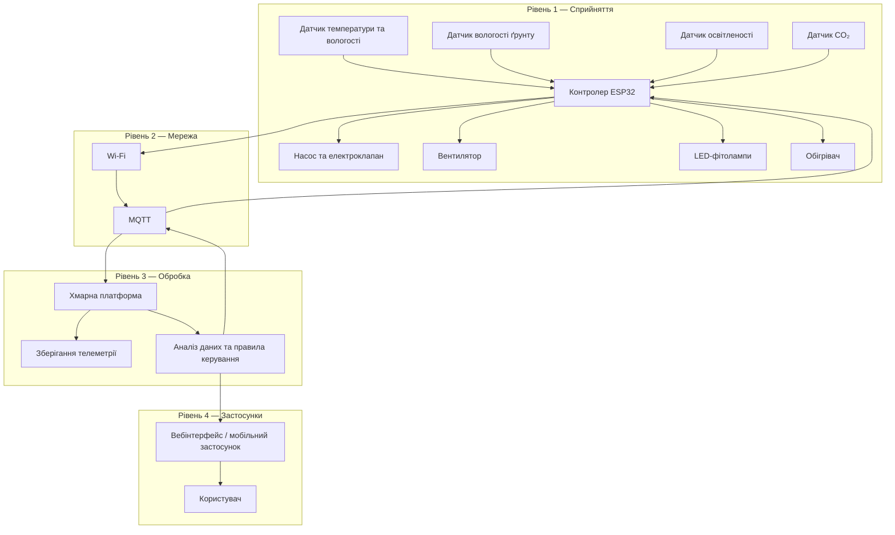

# Практична робота №1
## Вступ до IoT та SMART-технологій

**Варіант 1 — Розумна теплиця**

### Мета роботи

Навчитися аналізувати та проєктувати IoT-систему на рівні архітектури, визначати склад пристроїв, обирати місце обробки даних, оцінювати ризики безпеки та обґрунтовувати технічні рішення.

## 1. Опис системи

Проєктується IoT-система автоматичного вирощування рослин для теплиці площею 200 м².

Система повинна автоматично контролювати основні параметри середовища:

- температуру повітря;
- вологість повітря;
- вологість ґрунту;
- рівень освітленості;
- концентрацію CO₂.

На основі отриманих даних система керує:

- поливом;
- вентиляцією;
- досвітленням;
- обігрівом.

Основна мета системи — підтримувати необхідні умови у теплиці автоматично та забезпечувати її працездатність навіть у випадку тимчасової втрати зв'язку з хмарним сервісом.

## 2. Склад системи

| Пристрій | Що вимірює або виконує | Місце розміщення |
|---|---|---|
| Датчик температури та вологості повітря | Температура і вологість повітря | Усередині теплиці |
| Датчик вологості ґрунту | Вологість ґрунту | У ґрунті біля рослин |
| Датчик освітленості | Рівень природного освітлення | Усередині теплиці |
| Датчик CO₂ | Концентрація вуглекислого газу | Усередині теплиці |
| Контролер ESP32 | Збирає дані з датчиків та виконує локальні правила | У захищеному блоці керування |
| Насос та електроклапан | Керують поливом | Система поливу |
| Вентилятор | Забезпечує вентиляцію | У вентиляційній системі теплиці |
| LED-фітолампи | Забезпечують додаткове освітлення | Над рослинами |
| Обігрівач | Підтримує необхідну температуру | Усередині теплиці |

## 3. Архітектура IoT-системи

Система побудована за чотирирівневою архітектурою IoT: рівень сприйняття, мережевий рівень, рівень обробки та рівень застосунків.

Датчики передають показання контролеру ESP32. Контролер виконує локальну обробку та через Wi-Fi і MQTT передає телеметрію до хмарної платформи. У хмарі дані зберігаються й аналізуються, а користувач може переглядати стан теплиці через вебінтерфейс або мобільний застосунок.

Команди керування передаються у зворотному напрямку до ESP32, який керує насосом, вентиляцією, освітленням та обігрівом.

## 4. Обробка даних

Для системи розумної теплиці використовується поєднання edge-обробки та хмарної обробки.

Основні правила керування виконуються локально на контролері ESP32. Це дозволяє системі швидко реагувати на зміну температури, вологості ґрунту та інших параметрів без очікування відповіді від хмарного сервісу.

Наприклад:

- якщо температура перевищує допустиме значення — вмикається вентиляція;
- якщо вологість ґрунту занадто низька — запускається полив;
- якщо природного освітлення недостатньо — вмикаються LED-фітолампи;
- якщо температура занадто низька — вмикається обігрів.

Для локального керування бажана затримка реакції не більше кількох секунд. Тому критичні рішення виконуються на edge-рівні.

Хмарна платформа використовується для довготривалого зберігання телеметрії, перегляду історії показань та аналізу роботи системи.

## 5. Робота при втраті зв'язку з хмарою

При тимчасовій втраті доступу до хмарного сервісу теплиця продовжує працювати автономно.

ESP32 продовжує:

- отримувати показання датчиків;
- перевіряти локальні правила;
- керувати поливом;
- керувати вентиляцією;
- керувати освітленням;
- керувати обігрівом.

Телеметрія, яку не вдалося передати, тимчасово зберігається локально та може бути передана після відновлення зв'язку.

Таким чином, відсутність Інтернету не зупиняє основні функції теплиці.

## 6. Оцінка добового обсягу телеметрії

Для проєкту обрано періодичність опитування датчиків один раз на 60 секунд.

Кількість повідомлень за добу:

1440 хвилин × 1 повідомлення за хвилину = 1440 повідомлень на добу.

В одному повідомленні передаються значення:

- температури повітря;
- вологості повітря;
- вологості ґрунту;
- освітленості;
- концентрації CO₂;
- час вимірювання та ідентифікатор пристрою.

Для орієнтовного розрахунку приймемо розмір одного MQTT-повідомлення з даними близько 200 байт.

1440 × 200 = 288 000 байт на добу.

Отже, орієнтовний обсяг телеметрії одного контролера становить близько 0,29 МБ на добу без урахування додаткових мережевих накладних витрат.

## 7. Безпека

Для IoT-системи теплиці можна виділити такі основні загрози:

| Загроза | Можливі наслідки | Захід протидії |
|---|---|---|
| Несанкціонований доступ до контролера | Стороння особа може змінити режими поливу, вентиляції або обігріву | Використання унікальних облікових даних і складних паролів |
| Перехоплення даних у мережі | Зловмисник може отримати або змінити телеметрію та команди | Використання захищеного TLS-з'єднання |
| Втрата зв'язку з хмарою | Неможливість віддаленого керування та передавання даних | Локальне виконання правил на ESP32 і збереження телеметрії до відновлення зв'язку |
| Збій виконавчого механізму або контролера | Надмірний полив, перегрів або інша небезпечна ситуація | Передбачення безпечного стану: вимкнення насоса та обігрівача при критичному збої |

## 8. Джерела

1. [ITU-T Y.2060 (Y.4000) — Overview of the Internet of Things](https://www.itu.int/rec/T-REC-Y.2060). Дата звернення: 27.09.2026.
2. [NISTIR 8228 — Considerations for Managing Internet of Things (IoT) Cybersecurity and Privacy Risks](https://csrc.nist.gov/pubs/ir/8228/final). Дата звернення: 27.09.2026.
3. [ENISA — Baseline Security Recommendations for IoT](https://www.enisa.europa.eu/publications/baseline-security-recommendations-for-iot). Дата звернення: 27.09.2026.
4. [MQTT — офіційний сайт протоколу](https://mqtt.org/). Дата звернення: 27.09.2026.
