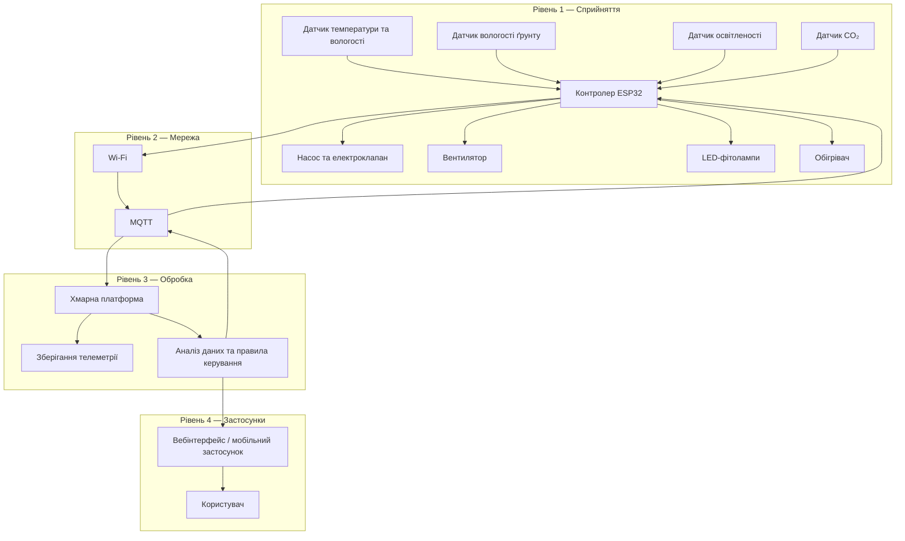

# Практична робота №1
## Вступ до IoT та SMART-технологій

**Варіант 1 — Розумна теплиця**

### Мета роботи

Навчитися аналізувати та проєктувати IoT-систему на рівні архітектури, визначати склад пристроїв, обирати місце обробки даних, оцінювати ризики безпеки та обґрунтовувати технічні рішення.

## 1. Опис системи

Проєктується IoT-система автоматичного вирощування рослин для теплиці площею 200 м².

Система повинна автоматично контролювати основні параметри середовища:

- температуру повітря;
- вологість повітря;
- вологість ґрунту;
- рівень освітленості;
- концентрацію CO₂.

На основі отриманих даних система керує:

- поливом;
- вентиляцією;
- досвітленням;
- обігрівом.

Основна мета системи — підтримувати необхідні умови у теплиці автоматично та забезпечувати її працездатність навіть у випадку тимчасової втрати зв'язку з хмарним сервісом.

## 2. Склад системи

| Пристрій | Що вимірює або виконує | Місце розміщення |
|---|---|---|
| Датчик температури та вологості повітря | Температура і вологість повітря | Усередині теплиці |
| Датчик вологості ґрунту | Вологість ґрунту | У ґрунті біля рослин |
| Датчик освітленості | Рівень природного освітлення | Усередині теплиці |
| Датчик CO₂ | Концентрація вуглекислого газу | Усередині теплиці |
| Контролер ESP32 | Збирає дані з датчиків та виконує локальні правила | У захищеному блоці керування |
| Насос та електроклапан | Керують поливом | Система поливу |
| Вентилятор | Забезпечує вентиляцію | У вентиляційній системі теплиці |
| LED-фітолампи | Забезпечують додаткове освітлення | Над рослинами |
| Обігрівач | Підтримує необхідну температуру | Усередині теплиці |

## 3. Архітектура IoT-системи

Система побудована за чотирирівневою архітектурою IoT: рівень сприйняття, мережевий рівень, рівень обробки та рівень застосунків.

Датчики передають показання контролеру ESP32. Контролер виконує локальну обробку та через Wi-Fi і MQTT передає телеметрію до хмарної платформи. У хмарі дані зберігаються й аналізуються, а користувач може переглядати стан теплиці через вебінтерфейс або мобільний застосунок.

Команди керування передаються у зворотному напрямку до ESP32, який керує насосом, вентиляцією, освітленням та обігрівом.
